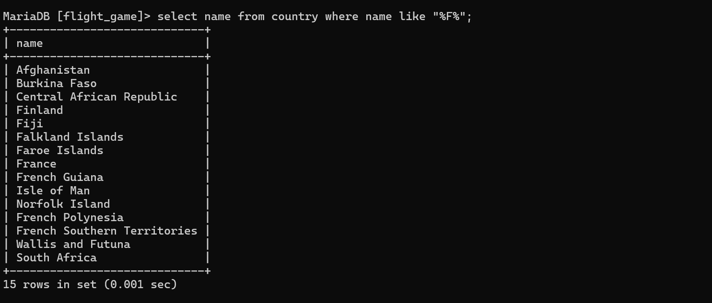
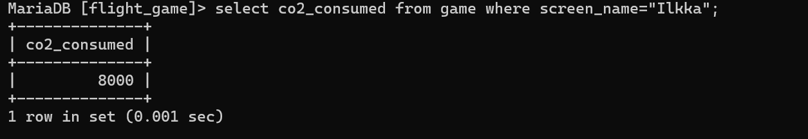
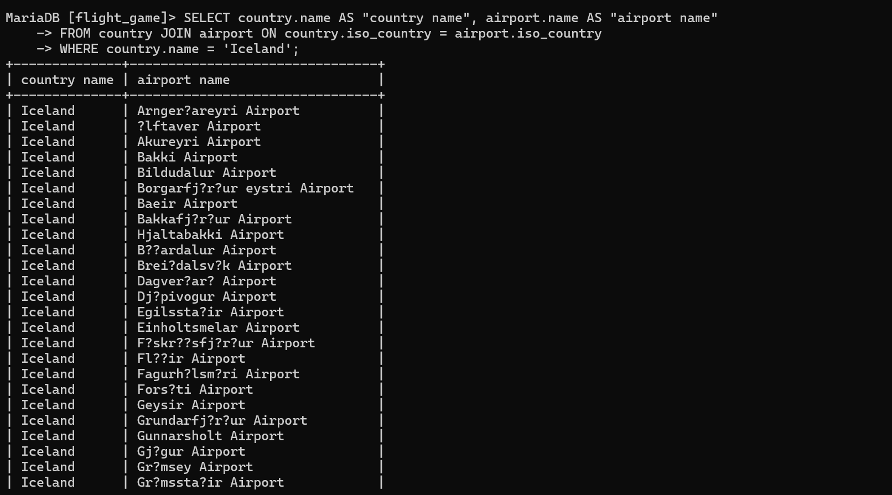
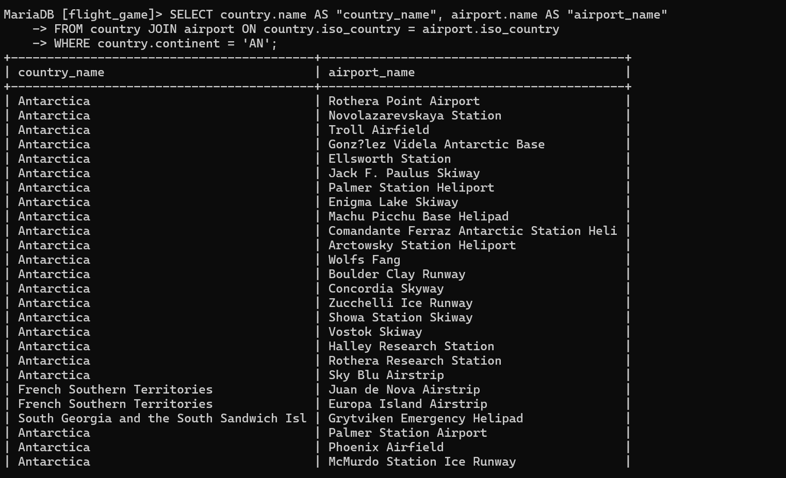
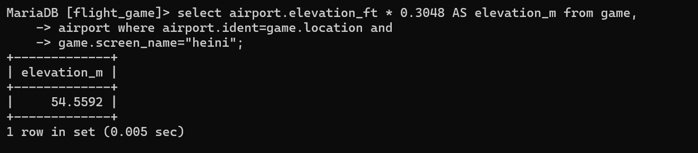
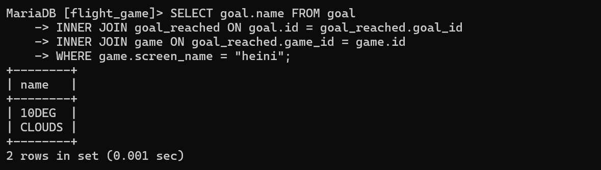

#week 3
###ASSIGNMENT 1 (EXERCISE2)

Q1 - 
select*from goal;

Q2 - 
select name,type from airport where iso_country="FI";

Q3
select name from airport where iso_country="FI" order by name asc;

Q4
select name,type from airport where iso_country="FI" order by type asc,name asc;

Q5
select name from country where name like "F%";

Q6
select name from country where name like "%F%";

Q7
select location from game where screen_name="Vesa";

Q8
select co2_consumed from game where screen_name="Ilkka";

Q9
SELECT DISTINCT co2_budget FROM game;

Q10
select screen_name, co2_budget, co2_consumed, co2_budget - co2_consumed as co2_left from game where screen_name="Ilkka";

###ASSIGNMENT 2 (EXERCISE3)

Q1
SELECT country.name AS "country name", airport.name AS "airport name" 
FROM country JOIN airport ON country.iso_country = airport.iso_country 
WHERE country.name = 'Iceland';

Q2
SELECT airport.name AS "airport name" FROM airport INNER JOIN 
country ON airport.iso_country = country.iso_country 
WHERE country.name = 'France' AND airport.type="Large_airport";

Q3
SELECT country.name AS "country_name", airport.name AS "airport_name" 
FROM country JOIN airport ON country.iso_country = airport.iso_country 
WHERE country.continent = 'AN';

Q4
select airport.name from game, airport 
where airport.ident=game.location and game.screen_name="Ilkka";

Q5
select airport.elevation_ft * 0.3048 AS elevation_m from game, 
airport where airport.ident=game.location and 
game.screen_name="heini";

Q6
select airport.name from game, airport 
where airport.ident=game.location and game.screen_name="Ilkka";

Q7
SELECT country.name FROM game 
JOIN airport ON airport.ident = game.location 
INNER JOIN country ON country.iso_country = airport.iso_country 
WHERE game.screen_name = "Ilkka";

Q8
SELECT goal.name FROM goal 
INNER JOIN goal_reached ON goal.id = goal_reached.goal_id
INNER JOIN game ON goal_reached.game_id = game.id
WHERE game.screen_name = "heini";

Q9
SELECT airport.name FROM airport  
INNER JOIN game ON airport.ident = game.location 
INNER JOIN goal_reached ON game.id = goal_reached.game_id
INNER JOIN goal ON goal_reached.goal_id = goal.id
WHERE goal.name = 'clouds'
AND game.screen_name = 'Ilkka';

Q10
SELECT country.name FROM airport  
INNER JOIN game ON airport.ident = game.location  
INNER JOIN goal_reached ON game.id = goal_reached.game_id  
INNER JOIN goal ON goal_reached.goal_id = goal.id  
INNER JOIN country ON airport.iso_country = country.iso_country  
WHERE goal.name = 'clouds' AND game.screen_name = 'Ilkka';

