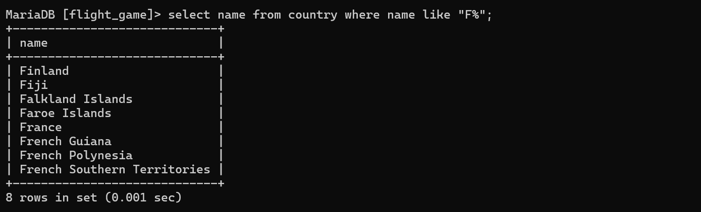
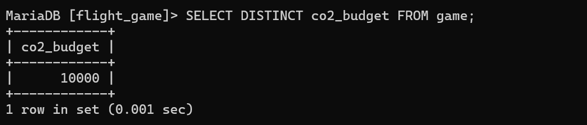

#week 3
###ASSIGNMENT 1 (EXERCISE2)

Q1 - 
select*from goal;

Q2 - 
select name,type from airport where iso_country="FI";

Q3
select name from airport where iso_country="FI" order by name asc;

Q4
select name,type from airport where iso_country="FI" order by type asc,name asc;

Q5
select name from country where name like "F%";

Q6
select name from country where name like "%F%";

Q7
select location from game where screen_name="Vesa";

Q8
select co2_consumed from game where screen_name="Ilkka";

Q9
SELECT DISTINCT co2_budget FROM game;

Q10
select screen_name, co2_budget, co2_consumed, co2_budget - co2_consumed as co2_left from game where screen_name="Ilkka";

###ASSIGNMENT 2 (EXERCISE3)

Q1

Q2

Q3

Q4

Q5

Q6

Q7

Q8

Q9

Q10

