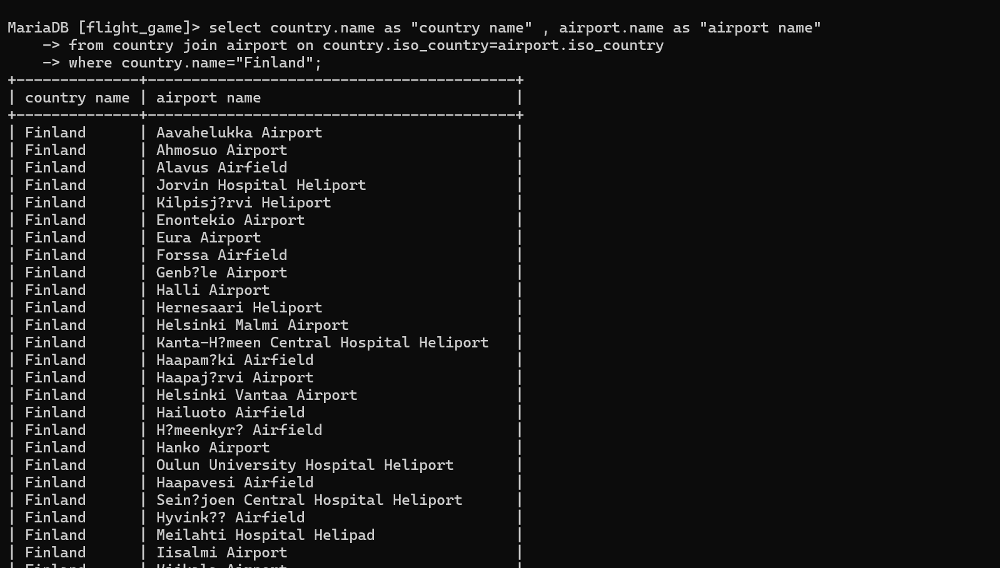
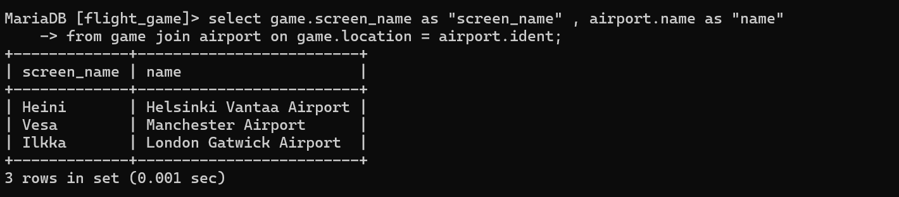
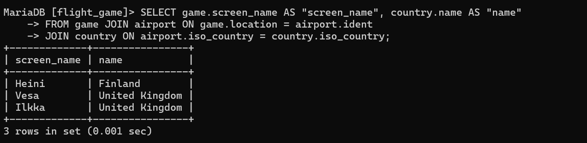
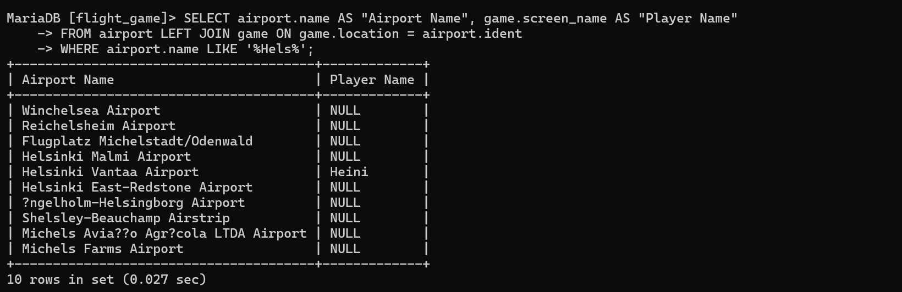
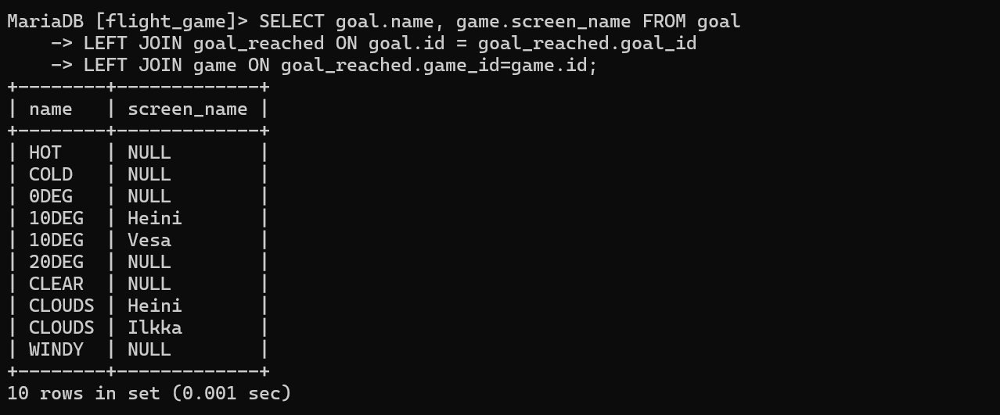
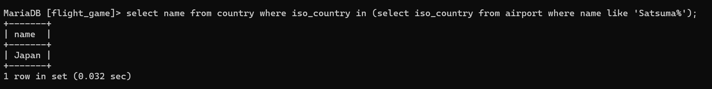
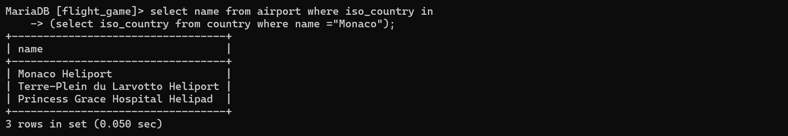
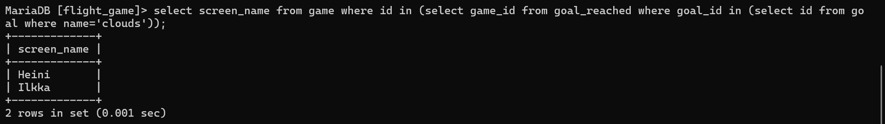
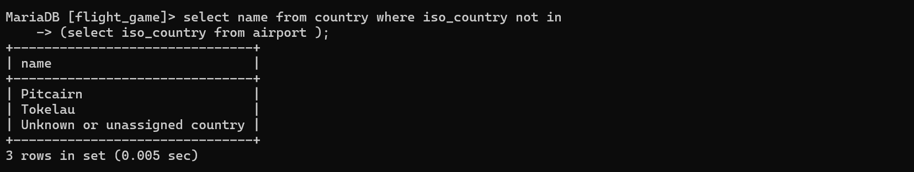
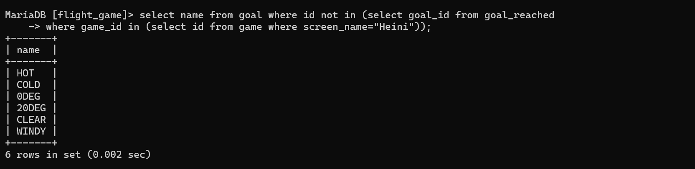

#week 3
###ASSIGNMENT 1 (EXERCISE4)

Q1 
select country.name as "country name" , airport.name as "airport name" 
from country join airport on country.iso_country=airport.iso_country 
where country.name="Finland";

Q2
select game.screen_name as "screen_name" , airport.name as "name" 
from game join airport on game.location = airport.ident;

Q3
SELECT game.screen_name AS "screen_name", country.name AS "name" 
FROM game JOIN airport ON game.location = airport.ident 
JOIN country ON airport.iso_country = country.iso_country; 

Q4
SELECT airport.name AS "Airport Name", game.screen_name AS "Player Name"
FROM airport LEFT JOIN game ON game.location = airport.ident 
WHERE airport.name LIKE '%Hels%';

Q5
SELECT goal.name, game.screen_name FROM goal 
LEFT JOIN goal_reached ON goal.id = goal_reached.goal_id  
LEFT JOIN game ON goal_reached.game_id=game.id;

###ASSIGNMENT 2 (EXERCISE5)

Q1
select name from country where iso_country in
(select iso_country from airport where name like 'Satsuma%');

Q2
select name from airport where iso_country in 
(select iso_country from country where name ="Monaco");

Q3
select screen_name from game where id in  
(select game_id from goal_reached where goal_id in 
(select id from goal where name='clouds'));

Q4
select name from country where iso_country not in 
(select iso_country from airport );

Q5
select name from goal where id not in (select goal_id from goal_reached 
where game_id in (select id from game where screen_name="Heini"));
