#WEEK 5
###ASSIGNMENT 1 (EXERCISE6)

Q1
select elevation_ft as "max(elevation_ft)" from airport 
where elevation_ft in (select max(elevation_ft)from airport);
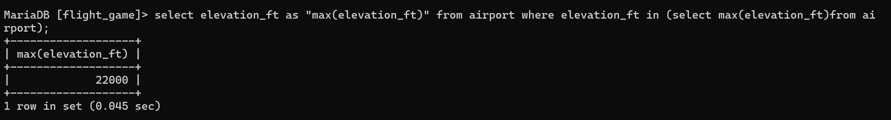

Q2
select continent, count(*) from country group by continent;
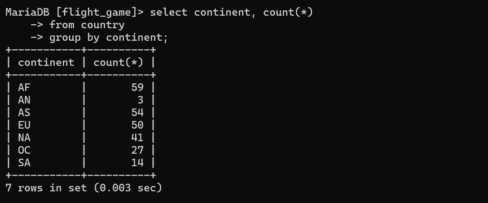

Q3
SELECT screen_name, count(*)
FROM goal 
JOIN goal_reached ON goal.id = goal_reached.goal_id  
JOIN game ON goal_reached.game_id=game.id
group by screen_name;
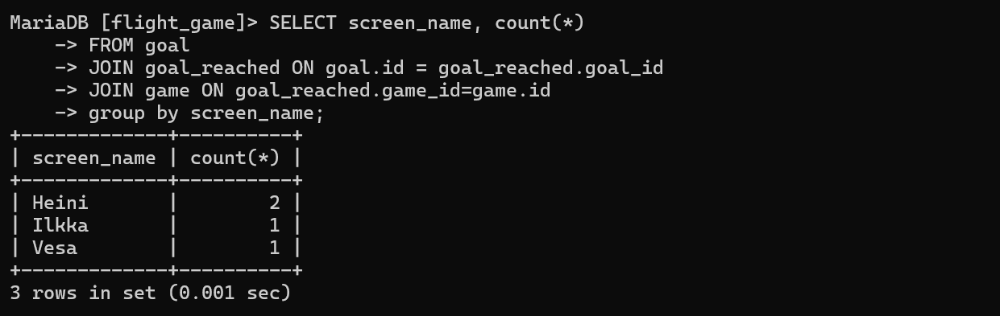

Q4
SELECT screen_name
FROM game
WHERE (co2_consumed - co2_budget)
AND (co2_consumed - co2_budget) = (
SELECT min(co2_consumed - co2_budget)
FROM game
WHERE (co2_consumed - co2_budget) );
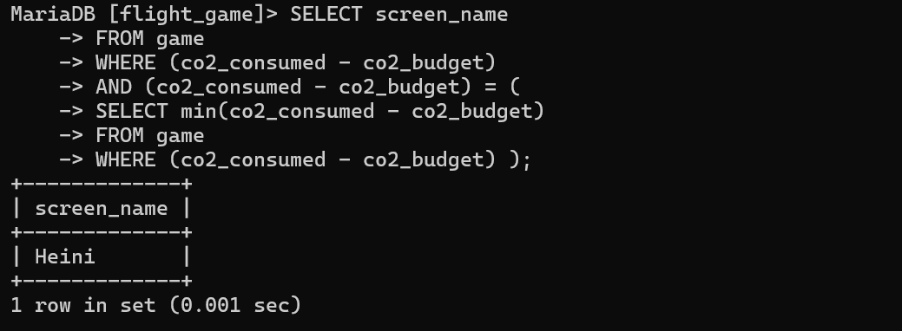

Q5
SELECT country.name, COUNT(*) 
FROM airport
JOIN country on airport.iso_country=country.iso_country
GROUP BY country.name
ORDER BY COUNT(*) DESC
LIMIT 50;
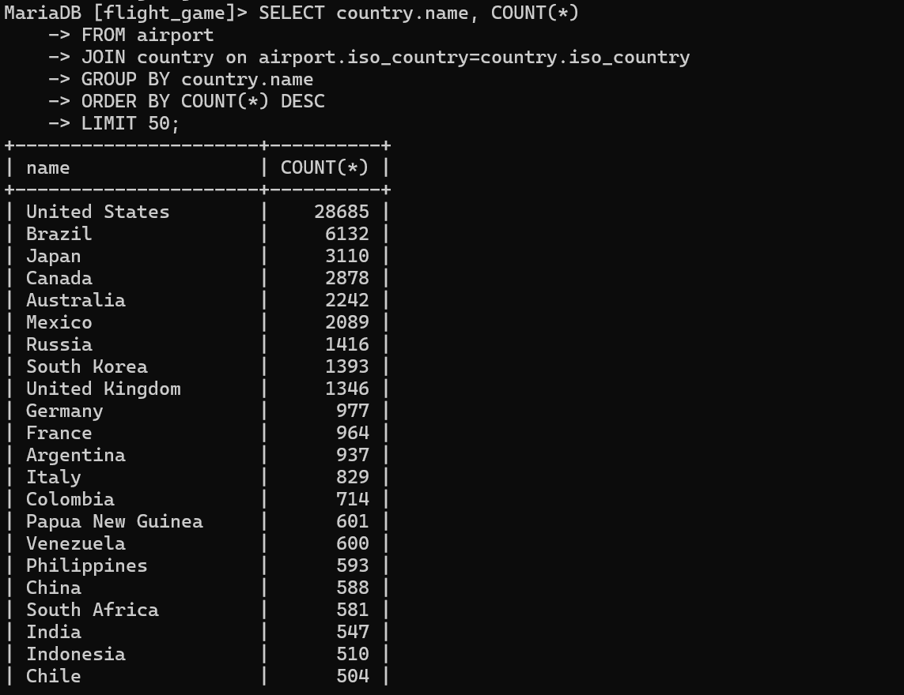

Q6
SELECT country.name
FROM airport
JOIN country on airport.iso_country=country.iso_country
GROUP BY country.name
HAVING COUNT(*)>1000;
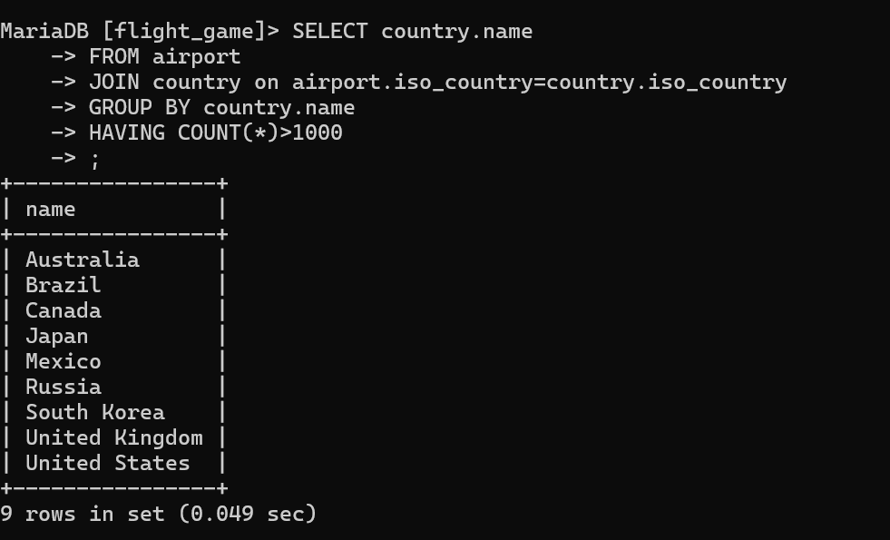

Q7
SELECT name
FROM airport
WHERE elevation_ft= (
SELECT MAX(elevation_ft)
FROM airport );
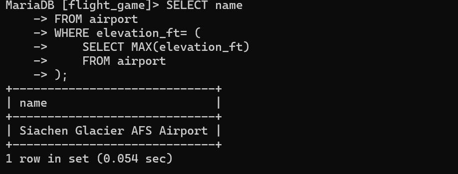

Q8
SELECT country.name
FROM airport 
JOIN country ON airport.iso_country = country.iso_country
WHERE airport.elevation_ft = ( 
SELECT MAX(elevation_ft)
FROM airport );
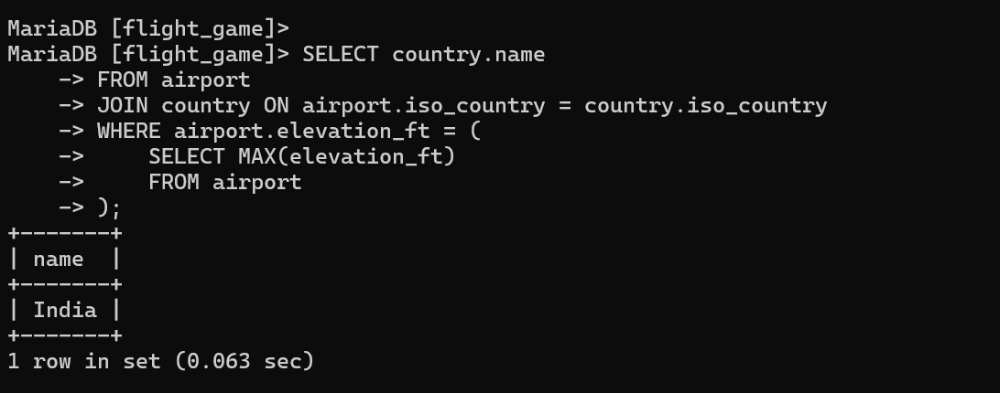

Q9
SELECT count(*)
FROM goal 
JOIN goal_reached ON goal.id = goal_reached.goal_id  
JOIN game ON goal_reached.game_id=game.id
WHERE screen_name="Vesa"
GROUP BY screen_name ;
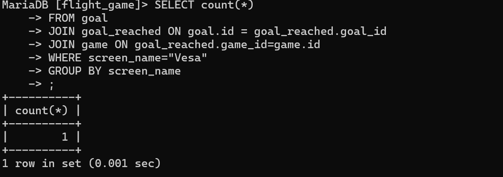

Q10
SELECT name
FROM airport
WHERE ABS(latitude_deg) = (
SELECT MAX(ABS(latitude_deg)) 
FROM airport );
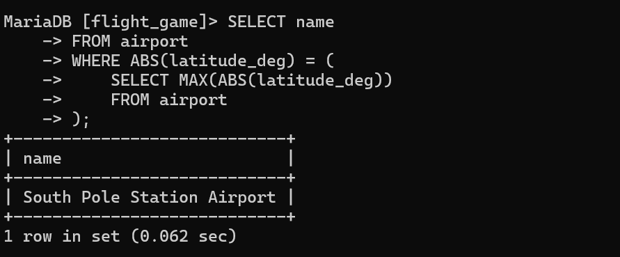

Q1
update game set location = (select ident from airport where name = 
"Nottingham Airport"), co2_consumed = co2_consumed+500 
where screen_name = "Vesa"; select * from game;
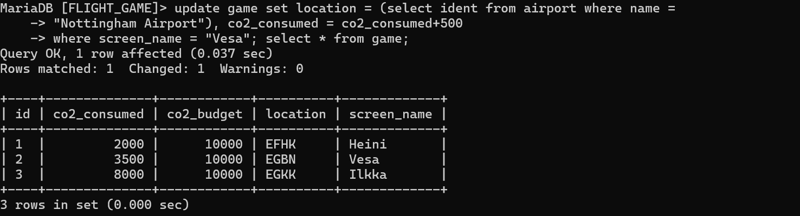

Q2
goal_reached

Q3
DELETE FROM goal_reached;

Q4
DELETE FROM game;
